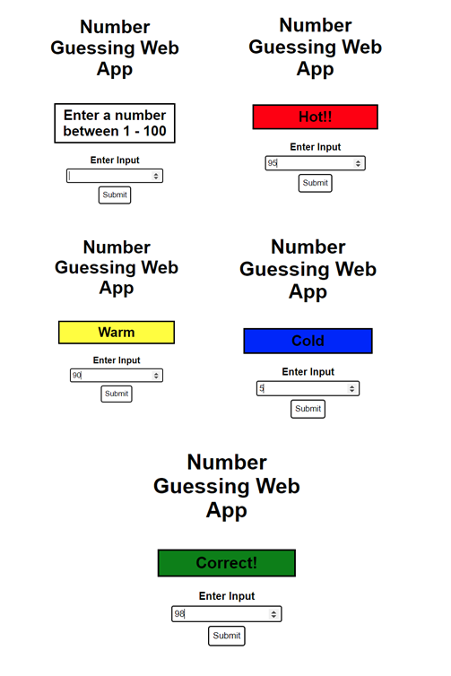
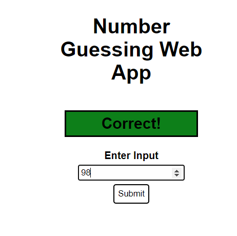
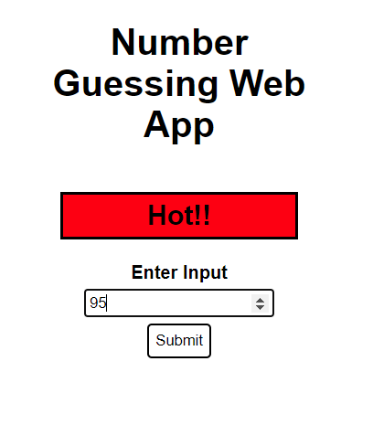

# 			Number Guessing Web App using React

1. The web app generates a random number between 1-100. 

2. On submit, the user will be given a response. The response will be based on the difference between the random number
generated and the user’s input.

3. The user is allowed to make any number of guesses, until he finds the correct
answer.

</img>

a. If the difference is 0 it will display ‘Correct!’
</img>
b. If the difference is 1-4 it will display ‘Hot!!’ 
</img>
c. If the difference is 5-15 it will display ‘Warm’
</img>
d. For anything beyond, it will display ‘Cold’ 
</img>